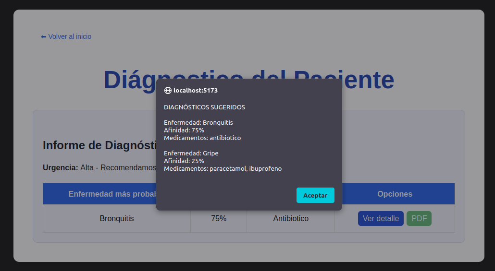
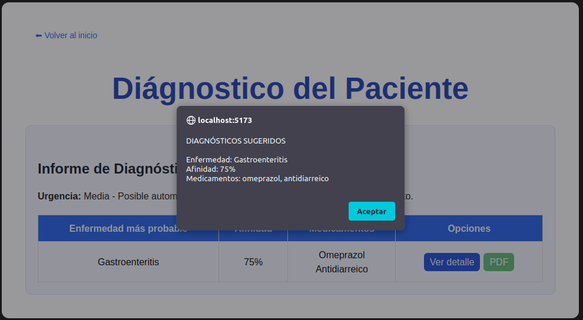

[REGRESAR](../README.md)

# DIAGNÓSTICOS

## Diagnóstico 1 – Gripe

El usuario presenta síntomas típicos de gripe. No tiene alergias ni enfermedades crónicas, por lo que se espera un diagnóstico directo basado en la coincidencia de síntomas.

| Síntomas | Alergías o condiciones médicas | Enfermedades crónicas |
| ---- | ----------- | --------------- | 
| fiebre, tos, dolor_cabeza   | []      | []           | 

Comentarios: ✅
- La afinidad es correcta: 3 coincidencias de 4 síntomas → 75%.
- Urgencia “media” también correcta porque los síntomas son moderados.

**Salida esperada:**
```
Enfermedad probable: gripe
Afinidad: 75%

Medicamentos recomendados:
- paracetamol
- ibuprofeno

Nivel de urgencia: media
```

**Resultados obtenidos:**


***
## Diagnóstico 2 – Bronquitis

El usuario presenta tos, dificultad para respirar y fatiga. Tiene alergia a penicilina, lo que afecta los medicamentos recomendados. No tiene enfermedades crónicas.

| Síntomas | Alergías o condiciones médicas | Enfermedades crónicas |
| ---- | ----------- | --------------- | 
| tos, dificultad_respirar, fatiga   | alergia penicilina      | []           | 

**Salida esperada:**
```
Enfermedad probable: bronquitis
Afinidad: 75%

Medicamentos recomendados:
- antibiotico

Medicamentos descartados:
- amoxicilina (alergia_penicilina)

Nivel de urgencia: alta
```

Comentarios: ✅
- Afinidad: 3/4 síntomas → 75%.
- Urgencia: alta, debido a “dificultad_respirar” → severo.
- Medicamentos: correcto, se descarta amoxicilina por alergia.

**Resultados obtenidos:**




***
## Diagnóstico 3 – Gastroenteritis

El usuario presenta dolor abdominal, diarrea y naúseas, tiene alergia a ibuprofeno y enfermedad crónica diabetes, lo cual no afecta directamente los medicamentos para gastroenteritis.


| Síntomas | Alergías o condiciones médicas | Enfermedades crónicas |
| ---- | ----------- | --------------- | 
|dolor_abdominal, diarrea, nauseas   | alergia ibuprofeno      | diabetes           | 

**Salida esperada:**
```
Enfermedad probable: gastroenteritis
Afinidad: 75%

Medicamentos recomendados:
- omeprazol
- antidiarreico

Nivel de urgencia: media
```

Comentarios: ✅
- Afinidad: 3/4 síntomas → 75%
- Urgencia: media (dolor_abdominal → moderado)
- Medicamentos: correctos, no hay contraindicación con alergia a ibuprofeno.

**Resultados obtenidos**




[REGRESAR](../README.md)
