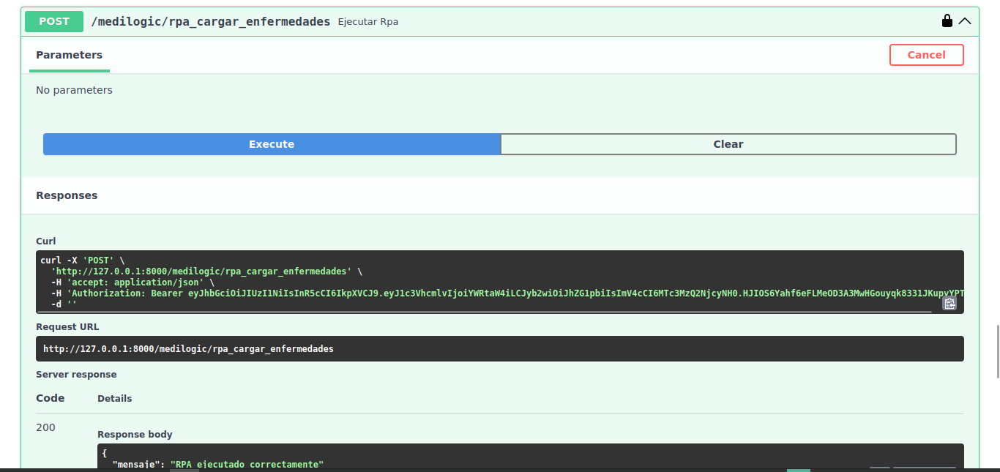
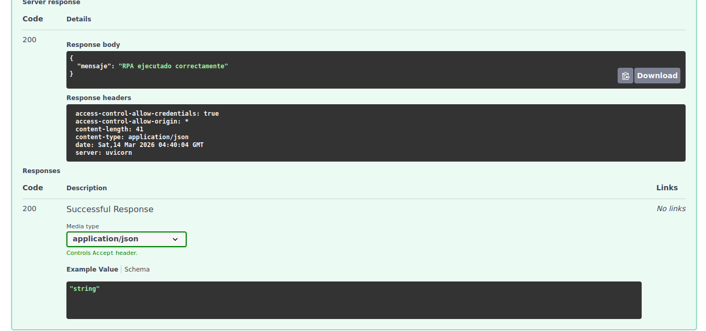

[REGRESAR](../README.md)

# Verificación de funcionamiento de RPA
Este apartado describe el proceso de carga automática de enfermedades utilizando el módulo de RPA del sistema.

1. Acceso a la documentación de la API

Para verificar el funcionamiento del RPA, primero se debe iniciar el servidor backend y acceder a la documentación interactiva generada por Swagger.

Abrir en el navegador:
- http://127.0.0.1:8000/docs

En esta interfaz se pueden visualizar y ejecutar los endpoints disponibles del sistema.




2. Ejecución del proceso RPA

Dentro de la documentación de la API se debe ubicar el endpoint encargado de realizar la carga automática de enfermedades:
```
POST /medilogic/rpa_cargar_enfermedades
```
Si el proceso se ejecuta correctamente, la API devolverá una respuesta confirmando que las enfermedades fueron cargadas.



3. Estructura del archivo a cargar

```
Nombre: nombreEnfermedad
Descripcion: descripcionEnfermedad
Sintomas: sintoma,sintoma
Medicamentos: medicamento
Contraindicados: contraindicacion
Sistema: sistema
Tipo: tipo
```

4. Estructura del envio de correos
```
correoExample1@gmail.com
correoExample2@gmail.com
.
.
.
```

[REGRESAR](../README.md)