[REGRESAR](../README.md)

# MANUAL TÉCNICO

## Arquitectura
La aplicación sigue un patrón **MVC por capas**:

- **Controllers**: Manejan las rutas de la API y la comunicación con el cliente.
- **Services**: Contienen la lógica de negocio, RPA y envío de correos.
- **Repositories**: Encapsulan el acceso a datos (archivo `.pl` de Prolog).
- **Main**: Inicializa FastAPI, carga middleware y conecta las capas.
- **logs**: archivo de bitacora que registra procedimientos y errores de ejecución.
- **config**: archivo donde se encuentran los correos a los que se les envia el informe.

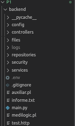

## Herramientas y técnologias

### Lenguajes de programación
- Backend - pyhton
    - Librerias: pyswip, PyAutoGUI
- Frontend - react + vite

### Motor lógico
- Prolog usando la libreria pyswip
- Archivo "medilogic.pl" en el que se incluye:
  - Hechos
  - Reglas

###  Instalar Dependencias
Instalación de dependencias principales:

```bash
pip install fastapi uvicorn pyswip python-dotenv
pip install python-multipart
npm install jspdf
```

- fastapi → Framework web.
- uvicorn → Servidor ASGI.
- pyswip → Integración con Prolog.
- python-dotenv → Carga de variables de entorno.
- python-multipart → Para manejar uploads de archivos en FastAPI.

## Descripción del problema a resolver
Este sistema propone el diseño e implementación de un sistema experto que, con base en lógica computacional, pueda analizar los síntomas, alergias y enfermedades preexistentes del usuario. Cuenta con dos módulos principales:

### Módulos principales 
 - Dashboard Pacientes
 - Dashboard Administrador

---

###  Dashboard Pacientes
Este módulo permite a los pacientes:

- Visualizar su historial médico.
- Consultar diagnósticos.
- Revisar medicamentos y alergias.
- Acceder a recomendaciones médicas.

**Vista general:**

| Funcionalidad               | Descripción                                      |
|-----------------------------|--------------------------------------------------|
| Consultar Diagnóstico       | Permite ver el resultado de sus síntomas.       |
| Historial de Medicamentos   | Lista los medicamentos prescritos anteriormente.|
| Registro de Síntomas        | Permite ingresar nuevos síntomas.               |
| Recomendaciones             | Sugiere medicamentos según alergias y condiciones.|

---

### Dashboard Administrador
Este módulo permite al administrador:

- Gestionar enfermedades y síntomas.
- Cargar archivos de reglas Prolog.
- Configurar contraindicaciones.
- Ejecutar RPA para actualizar la base de datos automáticamente.

**Vista general:**

| Funcionalidad                     | Descripción                                             |
|----------------------------------|---------------------------------------------------------|
| Agregar/Eliminar/Editar Enfermedades     | Permite crear o eliminar registros de enfermedades.    |
| Administrar Síntomas y Medicamentos | Gestiona información médica en la base de datos.     |
| Cargar/Descarga Archivos `.pl`             | Actualiza las reglas de lógica en Prolog.             |
| Ejecutar RPA                      | Automatiza la carga de nuevas enfermedades y envíos de correo.|

---

## Estructura del archivo .pl

El archivo **medilogic.pl** esta estructurado de la siguiente forma:

**Inicio**

- discontiguous: le dice a Prolog que los hechos o reglas de un mismo predicado no necesariamente estarán uno tras otro en el archivo
- dinamic: permite que los hechos del predicado puedan agregarse, eliminarse o modificarse en tiempo de ejecución desde el programa en Python usando PySwip o directamente en Prolog.

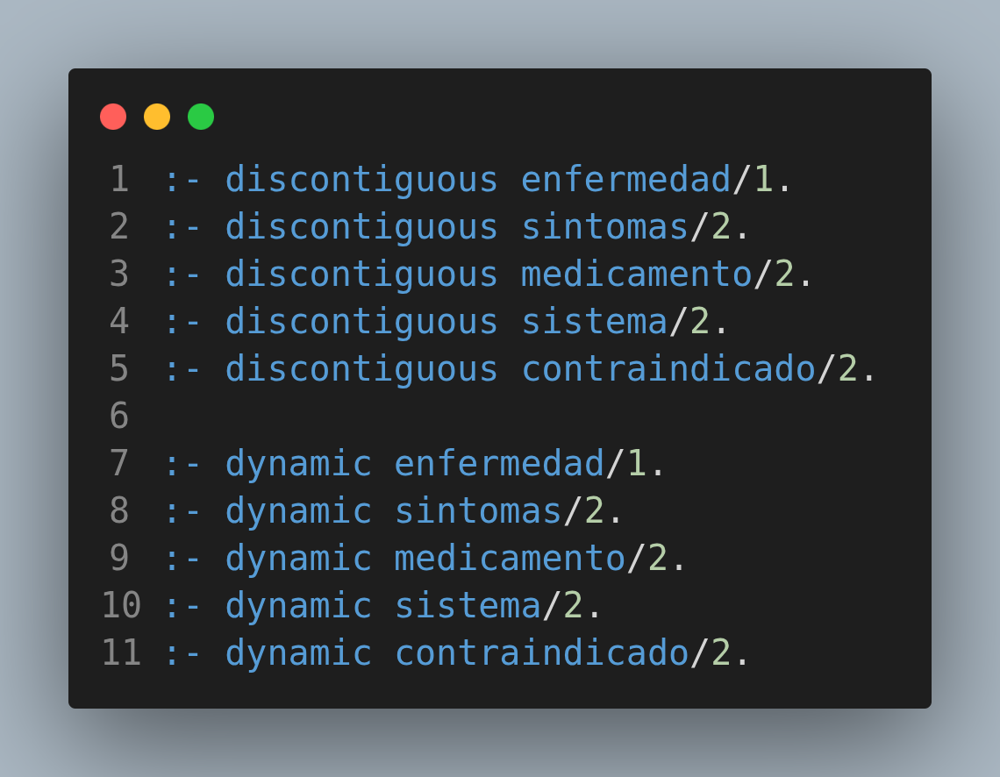


**Hechos**
- enfermedad(nombreEnfermedad): representa una enfermedad conocida por el sistema.

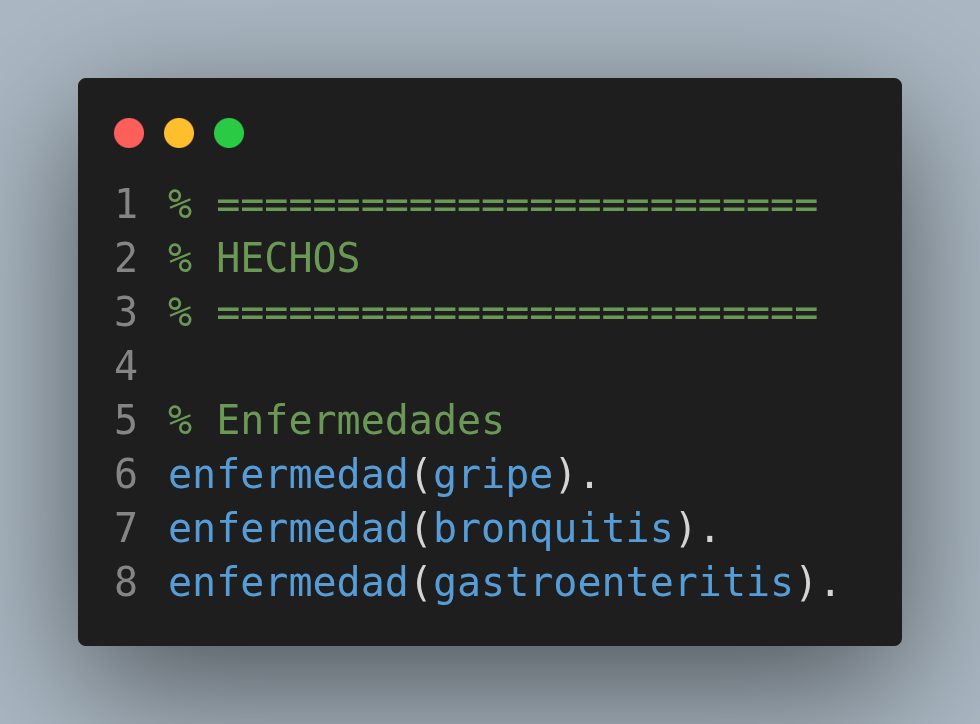

- sintoma(Enfermedad, Sintoma): relaciona una enfermedad con sus síntomas.

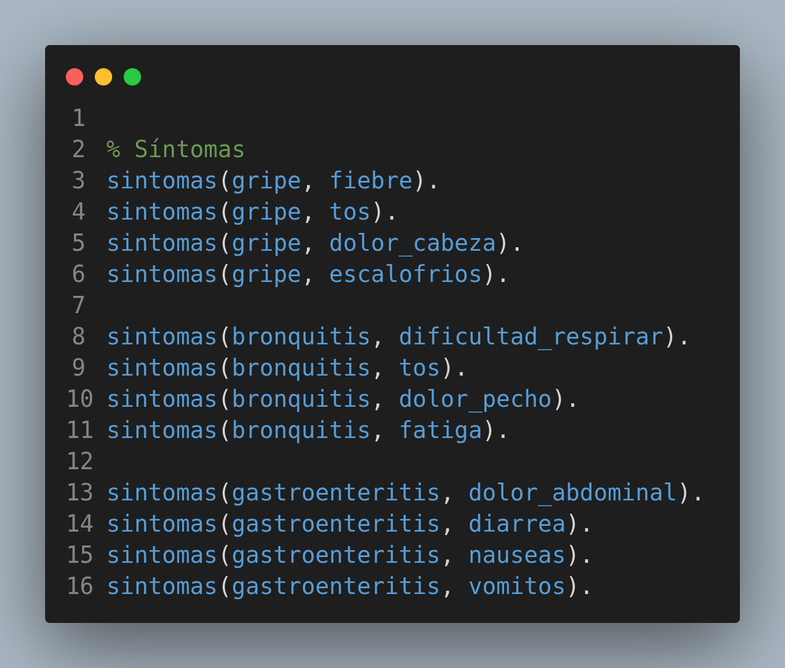 

- medicamento(Medicamento, Enfermedad): indica qué medicamento se usa para cada enfermedad.

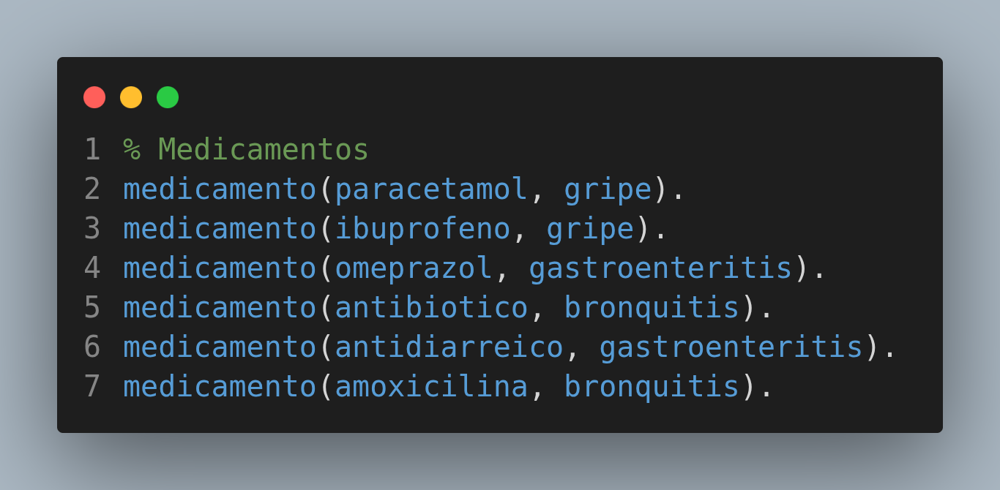 


- contraindicado(Medicamento, Alergia): lista de alergias o restricciones que hacen que un medicamento no sea seguro.

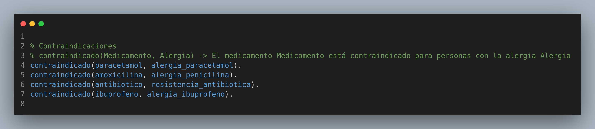 

- enfermedad_cronica(nombre): lista de enfermedades de largo plazo.

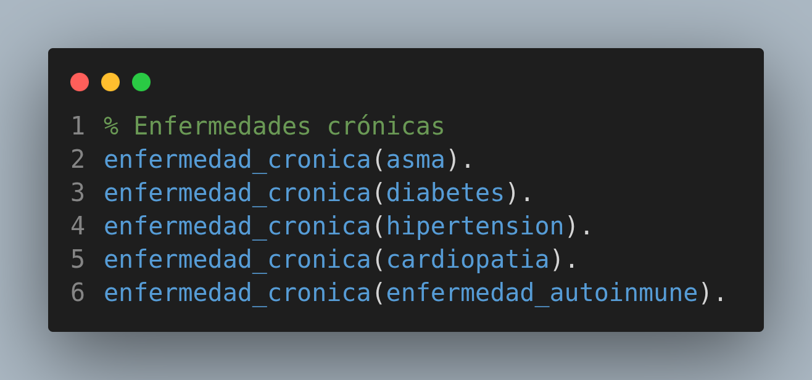 


- urgencia(Sintoma, nivel): indica la gravedad de cada sintoma, se usa para determinar el nivel de urgencia del paciente.

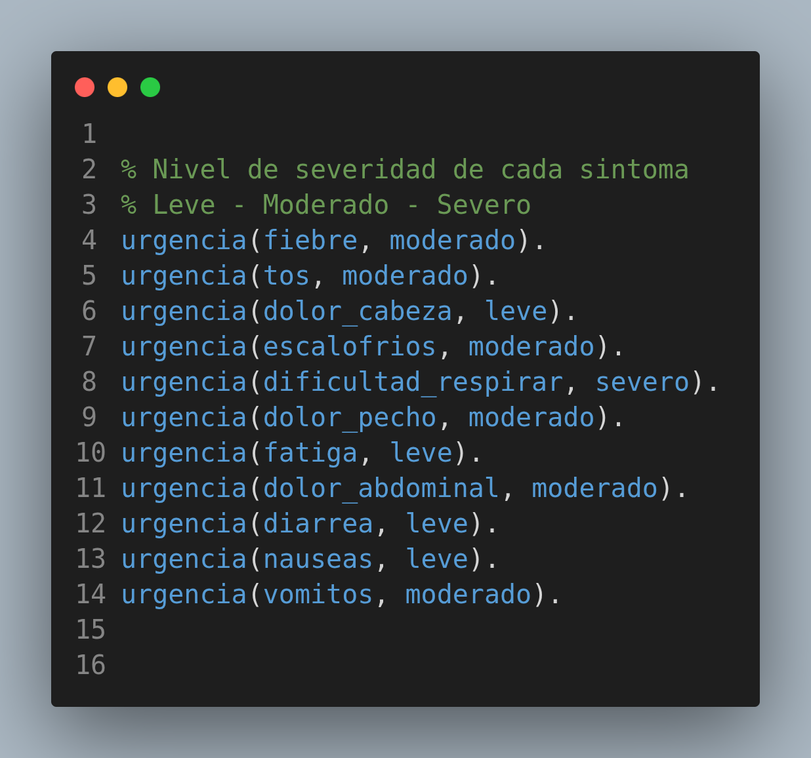 

- sistema(Enfermedad, sistema): clasifica las enfermedades según el sistema del cuerpo.

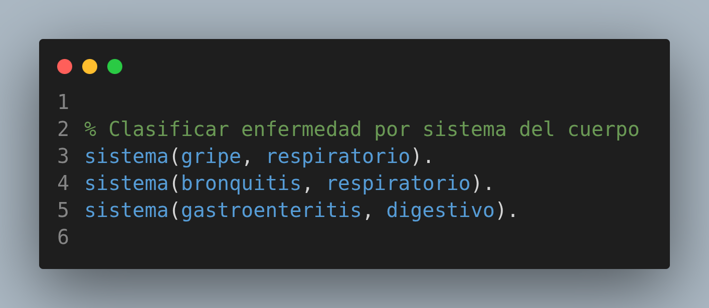 

**Reglas**


- contar_coincidencias(_, [], 0)
    - Contar cuántos síntomas de la enfermedad coinciden con los síntomas del paciente, Si la lista de síntomas del paciente está vacía ([]), la coincidencia es 0.
    - Es la condición que detiene la recursión.


-  contar_coincidencias(E, [S|R], N) :- sintomas(E, S), contar_coincidencias(E, R, N1), N is N1 + 1.

    - [S|R] separa la lista del paciente en:
        - S → primer síntoma
        - R → el resto de la lista
    - sintomas(E, S) verifica si el síntoma S pertenece a la enfermedad E.
        - Si es true, sumamos 1 a las coincidencias.
        - Si es false, no se suma, y solo seguimos con los síntomas restantes.
    - N is N1 + 1 suma la coincidencia encontrada al total parcial N1.

- contar_coincidencias(E, [_|R], N) :- contar_coincidencias(E, R, N).
    - Maneja los síntomas que no coinciden, asegurando que la recursión continúe.

**Recorrido**
```
% Síntomas de gripe: [fiebre, tos, dolor_cabeza]

?- contar_coincidencias(gripe, [fiebre, tos], N).
```

- Cómo Prolog lo procesa:

| Paso | Síntoma `S` | Lista resto `R` | `sintomas(E,S)` | Resultado parcial N1 | N final |
| ---- | ----------- | --------------- | --------------- | -------------------- | ------- |
| 1    | fiebre      | [tos]           | true            | 0+1                  | N=2     |
| 2    | tos         | []              | true            | 1+1                  | N=2     |

Resultado: N= 2 coincidencias

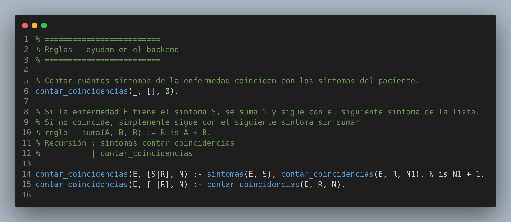 

- total_sintomas(E, Total):- findall(S, sintomas(E,S), Lista), length(Lista,Total)
    - calcula cuantos sintomas tiene en total una enfermedad.

- afinidad(E, ListaSintomas, Porcentaje)
    - contar_coincidencias(E, ListaSintomas, Coincidencias)
        - Compara la lista de sintomas del paciente con los sintomas que tiene la enfermedad(E)
    - total_sintomas(E, Total)
        - Calcula el total de sintomas que tiene la enfermedad
    - Total > 0
        - Evita división por cero, es decir la enfermeda debe tener al menos un síntoma.
    - Porcentaje is (Coincidencias / Total) * 100
        - Se calcula el porcentaje

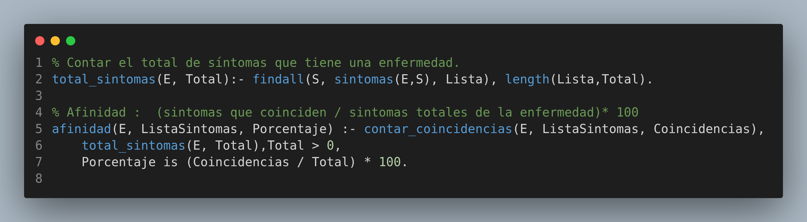 

- medicamento_recomendado( M , Enfermedad, Alergias)
    - medicamento(M,Enfermedad)
        - Esto busca en la base de datos de Prolog todos los medicamentos que están asociados con esa enfermedad.

    - \+ (member(A, Alergias), contraindicado(M, A))
        - member(A, Alergias) → toma cada alergia A del paciente de la lista Alergias.
        - contraindicado(M, A) → verifica si el medicamento M está contraindicado para la alergia A.
        - member(A, Alergias), contraindicado(M, A) → significa que existe al menos una alergia que contraindica el medicamento.
        - \+ (...) → no existe ninguna alergia en la lista que contraindique el medicamento.


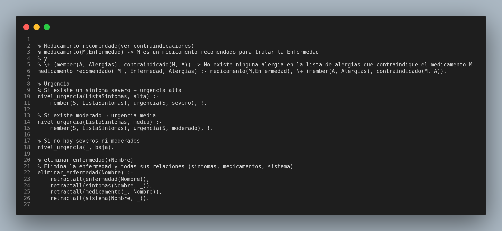 

- nivel_urgencia(ListaSintomas, alta)
    - Si en la lista de síntomas hay algún síntoma severo, entonces el nivel de urgencia es alta
- member(S, ListaSintomas)
    - Toma cada elemento S dentro de ListaSintomas uno por uno.
- urgencia(S, severo)
    - Consulta la base de datos de Prolog para ver si ese síntoma S está catalogado como severo.
- ! 
    - Una vez que encuentra un síntoma severo, Prolog detiene la búsqueda y no revisa más reglas. Esto evita que siga evaluando las siguientes reglas.

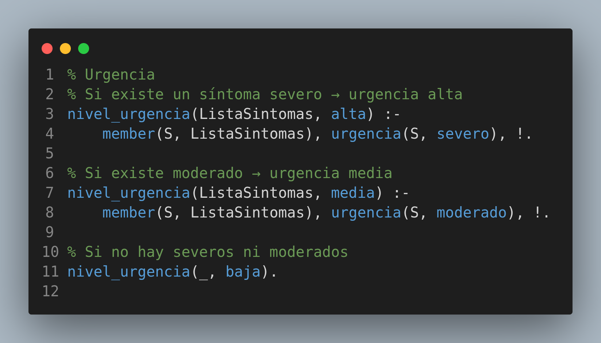 

- eliminar_enfermedad(Nombre)
    - Esta regla elimina una enfermedad completa de la base de datos Prolog y todas sus relaciones.

- retractall(enfermedad(Nombre))
    - Borra todas las ocurrencias de enfermedad(Nombre).

- retractall(sintomas(Nombre, _))
    - Borra todos los síntomas asociados a esa enfermedad. _ significa “cualquier valor” (no importa cuál sea).

- retractall(medicamento(_, Nombre))
    - Borra todos los medicamentos que tratan esa enfermedad.

- retractall(sistema(Nombre, _))
    - Borra la información del sistema del cuerpo al que pertenece la enfermedad.

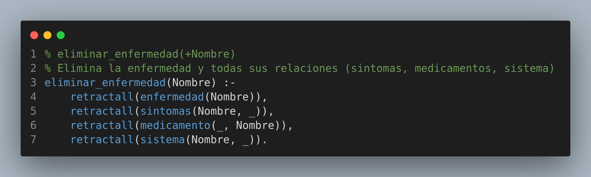 

## Interacción entre los modulos
Se tiene una arquitectua MVC en el que se encuentran las carpetas

- backend/
    - config/
        - correos.txt
    - controllers/
        - medilogic_controller.py
    - files/
        - enfermedades.txt
    - logs/
        - bitacora.txt
    - services/
        - medilogic_service.py
        - bitacora_service.py
        - correo_service.py
        - rpa_service.py
    - repositories/
        - medilogic_repo.py
        - rpa_repo.py
    - medilogic.pl
    - main.py


### Clases Principales

***
#### medilogic_repo
*** 

Encapsula la interacción con el archivo Prolog (medilogic.pl), se encarga de la parte de datos.

Funciones principales:
- obtener_enfermedades()
- obtener_sintomas_por_nombre()
- calcular_afinidad()
- obtener_medicamentos_por_enfermedad()
- obtener_medicamentos_recomendados
- obtener_diagnostico_completo()
- agregar_contraindicacion()
- eliminar_contraindicacion()

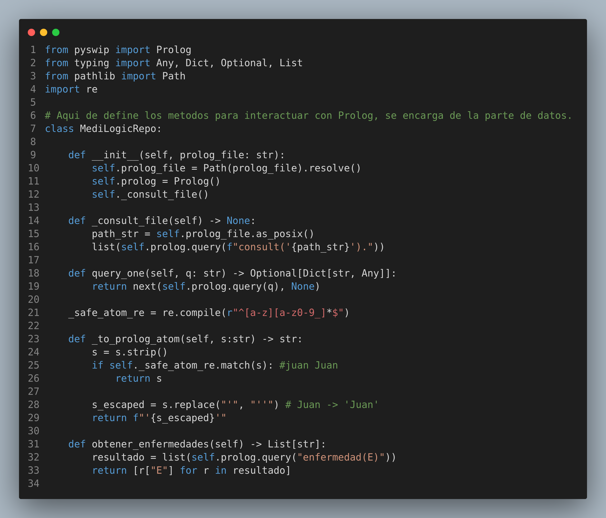

****
#### medilogic_service
****

Lógica de negocio, conecta Repo con los controladores. Se encarga de procesar los datos y aplicar reglas de negocio.


Métodos de diagnóstico (diagnosticar, obtener_diagnostico_completo)
- diagnosticar()
- obtener_sintomas_por_nombre()
- obtener_medicamentos_por_enfermedad()
- agregar_enfermedad()
- agregar_contraindicacion()
- eliminar_contraindicacion()

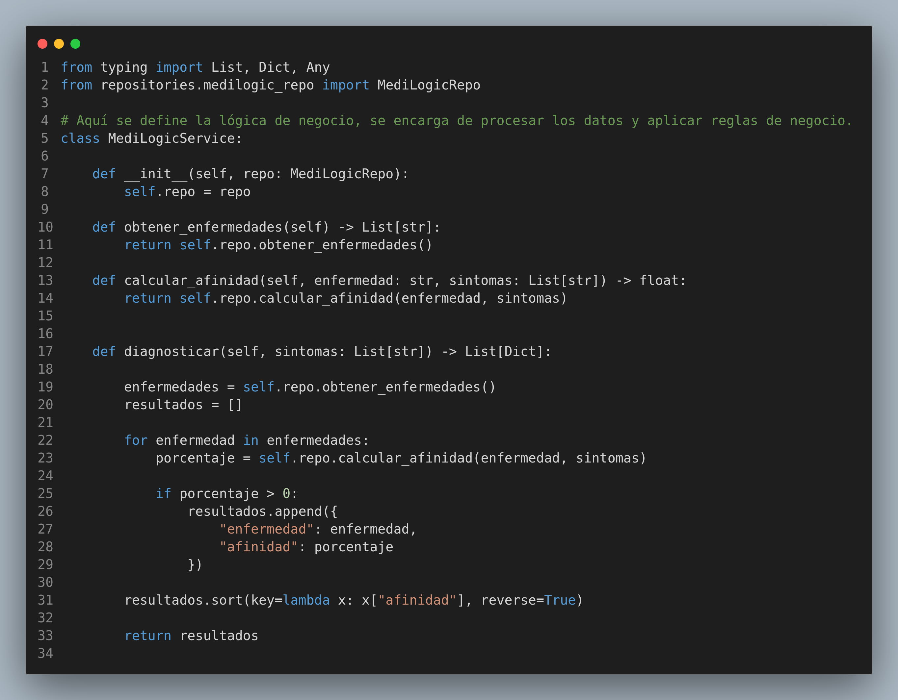


****
#### medilogic_controller
****

Es la capa que se encarga de recibir las solicitudes del usuario (frontend o Postman), procesarlas y enviarlas al service, que contiene la lógica de negocio real.

Controladores y rutas
- /medilogic/enfermedades → GET, lista todas las enfermedades.
- /medilogic/sintomas/{nombre} → GET, obtiene síntomas por enfermedad.
- /medilogic/medicamentos/{nombre} → GET, obtiene medicamentos.
- /medilogic/diagnosticos → POST, realiza diagnóstico basado en síntomas.
- /medilogic/medicamentos_recomendados → POST, sugiere medicamentos según alergias.
- /medilogic/diagnostico-completo → POST, diagnóstico completo considerando alergias y enfermedades crónicas.
- /medilogic/admin/agregar_enfermedad → POST, agrega enfermedad (solo admin).
- /edilogic/admin/eliminar_enfermedad/{nombre} → DELETE, elimina enfermedad (solo admin).
- /medilogic/rpa_cargar_enfermedades → POST, ejecuta RPA para cargar enfermedades.

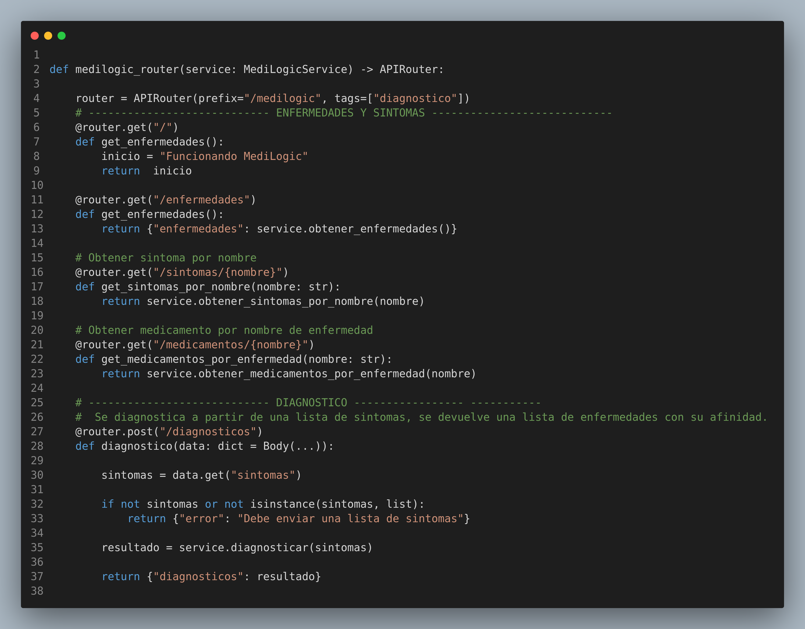

****
#### rpa_service
****

Automatiza la carga de enfermedades desde archivos.

- leer_archivo(ruta) → Extrae enfermedades de enfermedades.txt.
- guardar_enfermedades(enfermedades) → Inserta en el repositorio.
- generar_informe(enfermedades) → Crea informe.txt.
- leer_correos() → Obtiene lista de correos para notificación.
- ejecutar() → Ejecuta todo el proceso y envía correo.

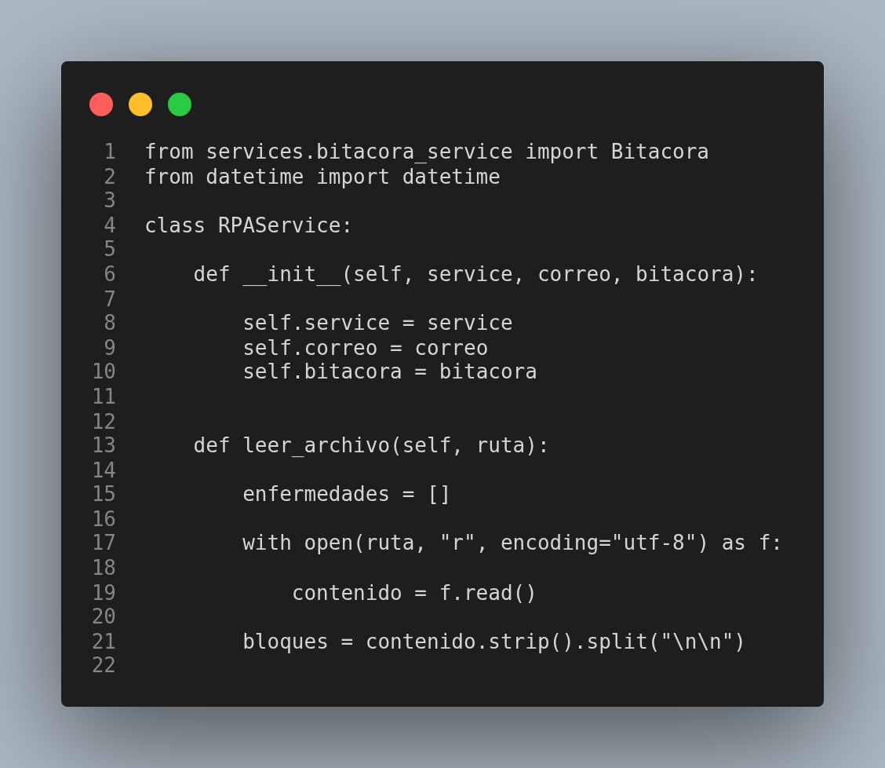


****
#### correo_service
****
Envía correos electrónicos con informes.

- enviar(destinatarios: list, informe: str)

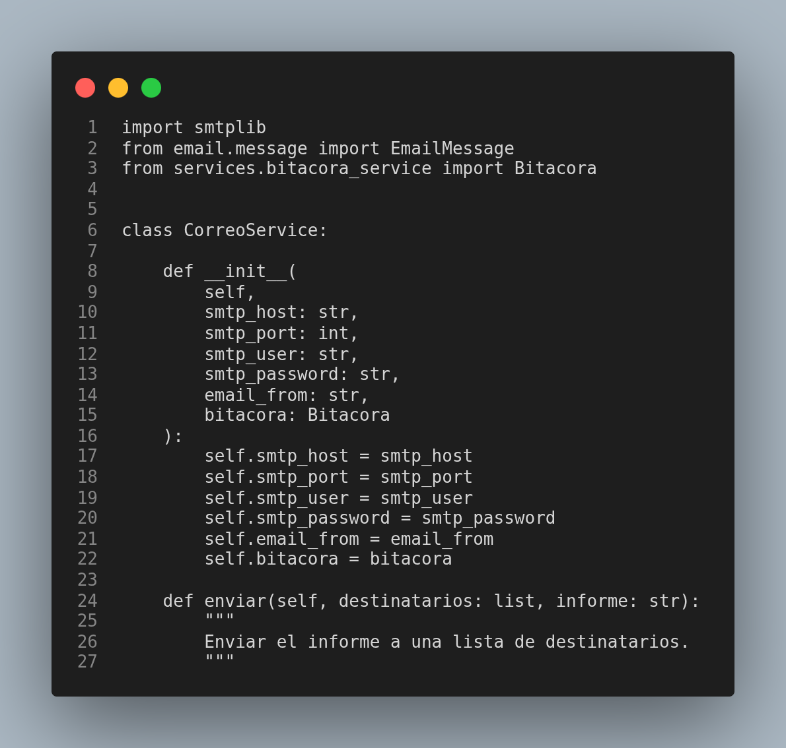


****
#### Bitacora
****

Registra en archivo de logs (logs/bitacora.txt) todas las acciones importantes.

- escribir(mensaje: str)

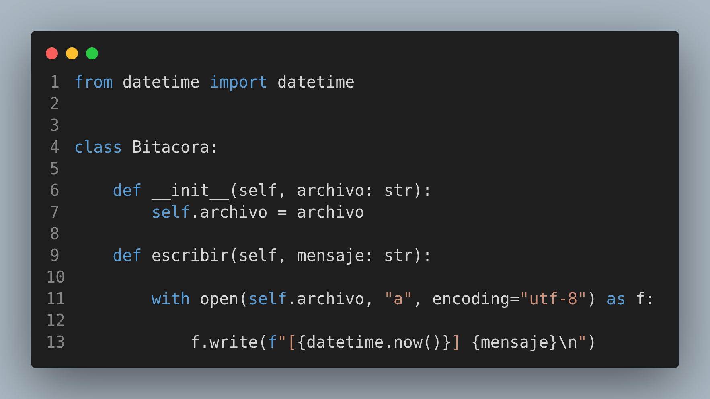


## Funcionamiento de RPA

- RPAService.leer_archivo("files/enfermedades.txt") → Extrae información.

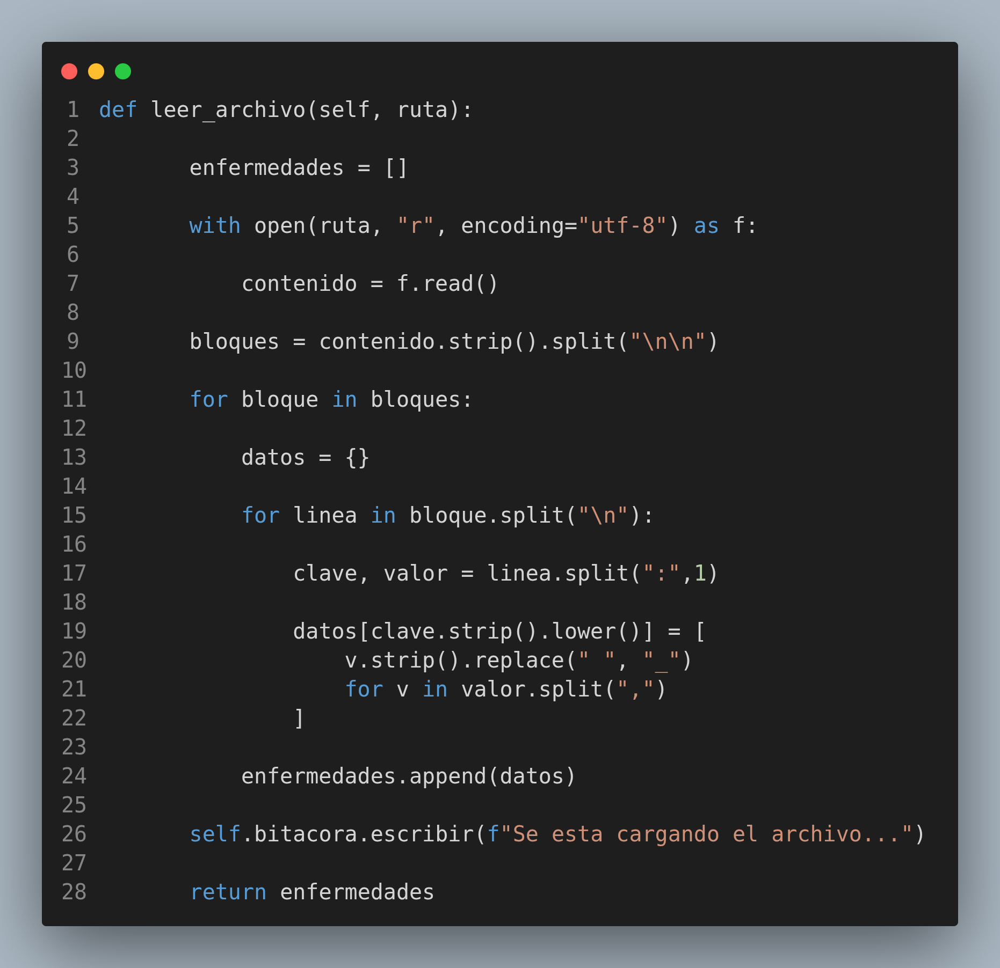 

- RPAService.guardar_enfermedades(enfermedades) → Inserta en Prolog y genera contraindicaciones.

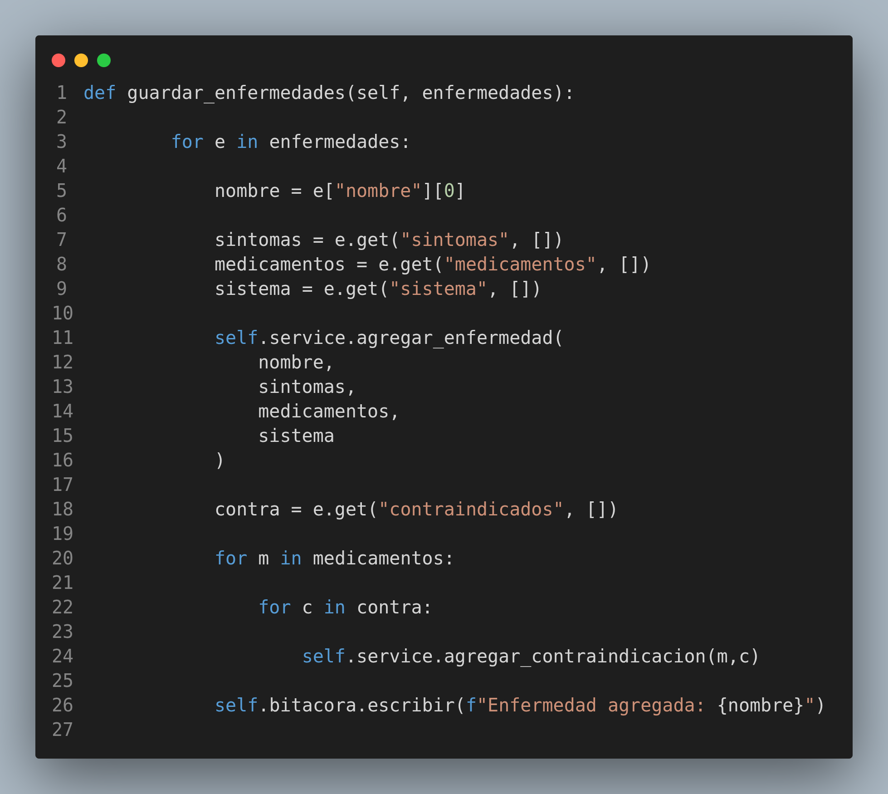 

- RPAService.generar_informe(enfermedades) → Crea informe detallado.

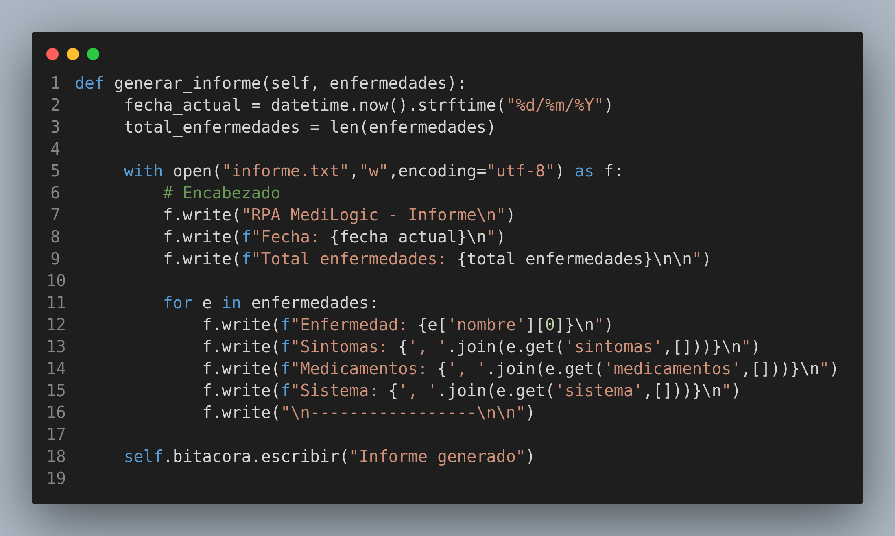 

- RPAService.leer_correos() → Obtiene correos de config/correos.txt. y se envian

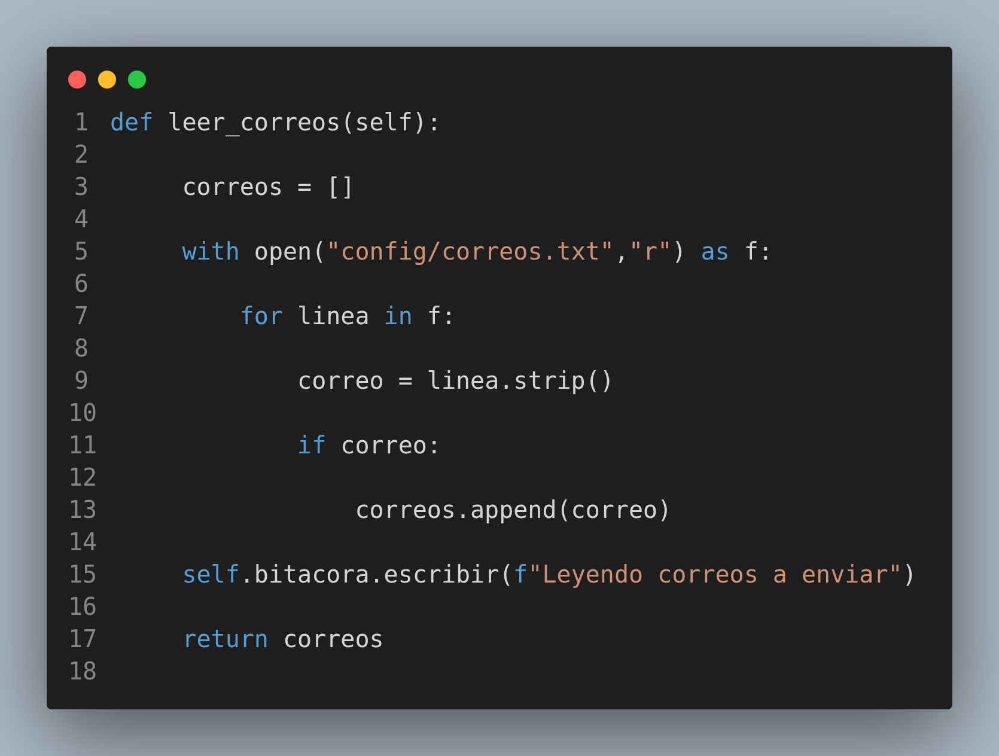 

## LOGIN

#### medilogic_controller.py
*** 
- Recibe usuario y password desde el frontend.
- Verifica si las credenciales coinciden con las definidas (admin / 1234).
- Si coinciden:
    - Llama a crear_token y genera un JWT con la información del usuario y su rol.
    - Devuelve el token al frontend en formato JSON: {"token": "<jwt>"}.
- Si no coinciden, devuelve un mensaje de error.

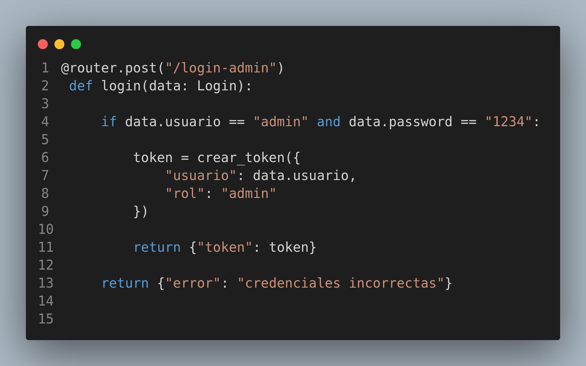 

***
#### auth_middleware.py
***
- Obtiene el token enviado en el header Authorization: Bearer <token>.
- Llama a verificar_token para validar la firma y expiración.
- Si el token es inválido → HTTP 401 (no autorizado).
- Si el token no pertenece a un admin → HTTP 403 (prohibido).
- Si todo es correcto, devuelve el payload para usarlo dentro de la ruta.

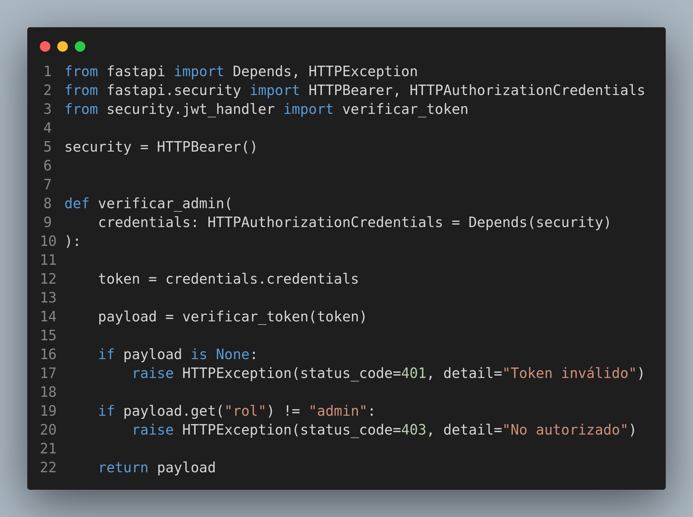 

***
#### jwt_handler.py
***

- SECRET_KEY: clave secreta usada para firmar los tokens. Debe mantenerse confidencial.
- ALGORITHM: algoritmo de cifrado, aquí se usa HS256.
- ACCESS_TOKEN_EXPIRE_MINUTES: duración del token (60 minutos).
- crear_token(data)
    - Copia los datos que quieres incluir en el token (usuario y rol).
    - Calcula la fecha de expiración sumando 60 minutos a la hora actual.
    - Agrega "exp" al diccionario de datos.
    - Genera el token JWT con la librería jose.jwt.
    - Devuelve el token codificado, que luego será enviado al frontend.
- verificar_token(token)
    - Decodifica el token usando la clave secreta y el algoritmo HS256.
    - Si el token es válido, devuelve el payload (la información dentro del token, ej. usuario y rol).
    - Si hay un error (token expirado, modificado o inválido), devuelve None.

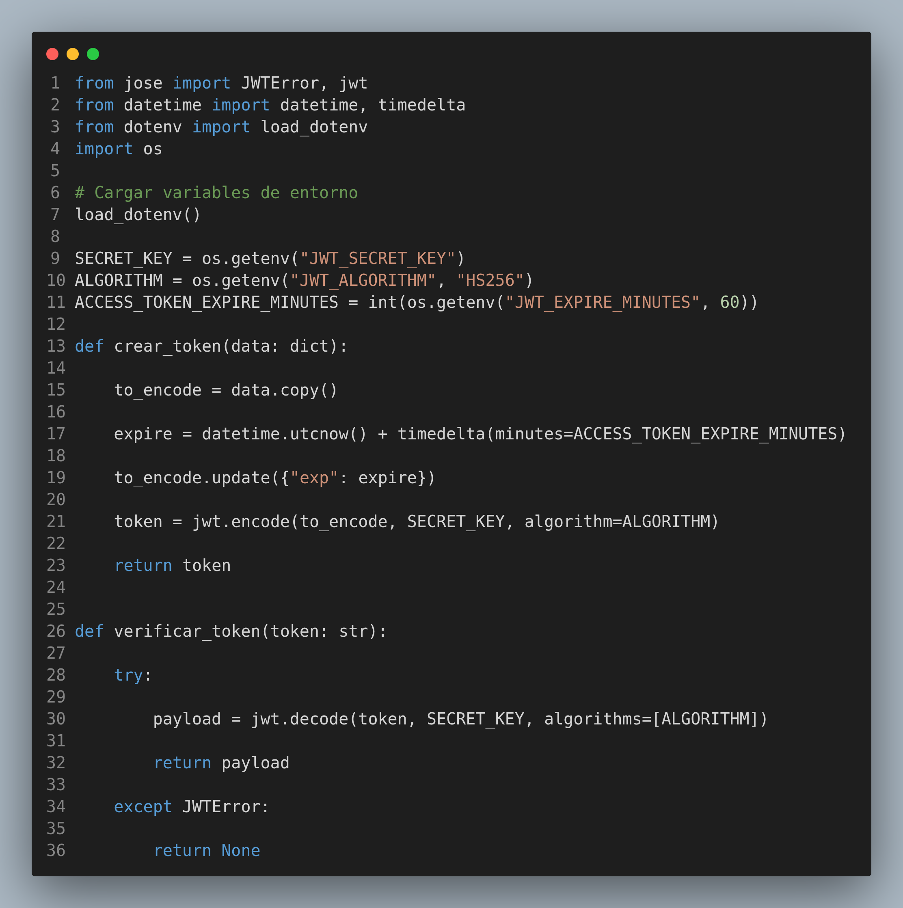 

# Frontend 

El frontend del sistema MediLogic está desarrollado usando React con Vite como herramienta de construcción. Su objetivo principal es interactuar con el backend a través de llamadas a la API y mostrar información al usuario.

## Estructura General
- Carpeta src/components/: Contiene todos los componentes reutilizables (formularios, dashboards, tablas).

- Carpeta src/pages/: Contiene las vistas principales (Dashboard Pacientes, Dashboard Administrador, Login).

- Carpeta src/services/: Contiene funciones para consumir las APIs del backend.

- Archivo main.tsx: Punto de entrada de la aplicación React.

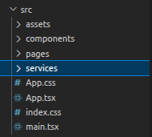

## Requerimientos Técnicos

- Node.js ≥ 18
- npm ≥ 9

Dependencias principales:
```
npm install react react-dom react-router-dom
npm install axios
npm install vite
```

## Diagrama de flujo de interacción

Usuario 

       → Frontend (React + Vite)

       → Componente / Formulario

       → Servicio HTTP (fetch/axios)

       → Backend (FastAPI)

       → Controller → Service → Repositorio → Prolog (.pl)

       → Respuesta JSON

       → Frontend muestra resultados
       
[REGRESAR](../README.md)