[REGRESAR](../README.md)

# MANUAL DE USUARIO

## Descripción

MediLogic es un sistema de soporte para diagnóstico médico que permite registrar enfermedades, sus síntomas, medicamentos y generar informes automáticamente.

## Requisitos del Sistema

- Software necesario:
    - Navegador web moderno (Chrome, Edge, Firefox)
    - Node.js y npm (para frontend React + Vite)
    - Python 3.10+ (para backend FastAPI)

- Archivos importantes:
    - files/enfermedades.txt
    - config/correos.txt
    - .env con credenciales

- Acceso a internet para envío de correos.

## Inicio de Sesión
El módulo de Administrador es el único que se necesitan credenciales para ingresar a su dashboard.

Flujo:
- Ingresar usuario y contraseña.
- Recibir token JWT válido por 60 minutos.
- Acceder a funcionalidades de administrador.

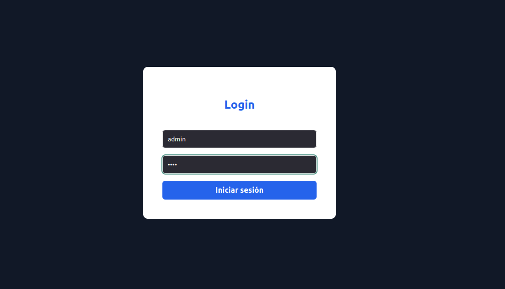

## Funcionalidades Principales

### Home
***

Es la primer vista que el usuario observara, tendrá la opción de seleccionar el modulo de:
- Paciente
- Adminstrador

Nota: tomar en cuenta que al ingreso del dashboard Administrador se necesitan credenciales.

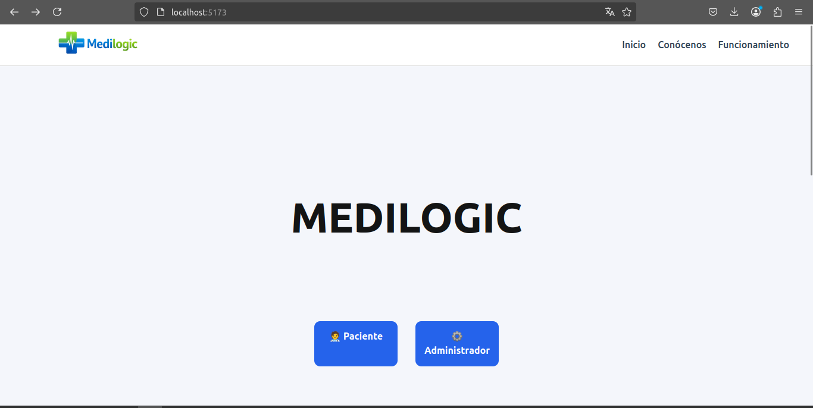

- Conócenos: se muestra una descripción general del sistema
- Funcionamiento: se muestra una descripción de su funcionamiento.

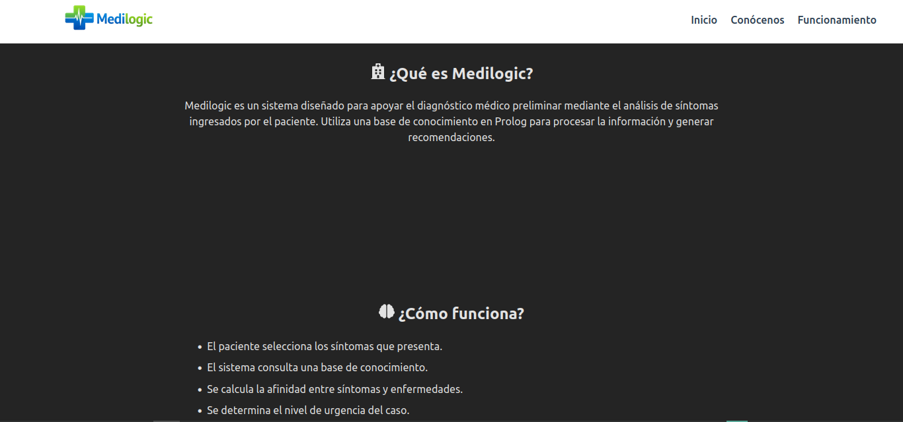

***
### Dashboard Paciente
***
Al ingresar a este módulo el usuario podrá hacer lo siguiente:
- Seleccionar sus síntomas y su nivel de gravedad
- seleccionar alergías o condiciones médicas
- seleccionar enfermedades crónicas.
- Hacer click en "Analizar síntomas".

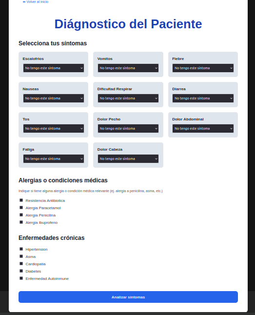

En base a lo que el usuario seleccione, el sistema se dara un diagnóstico general.
El usuario visualiza una tabla con infomación de que enfermedad en probable en base a lo que selecciono y tiene las opciones de:
- Ver detalle: un diagnóstico más general
- Descargar en PDF
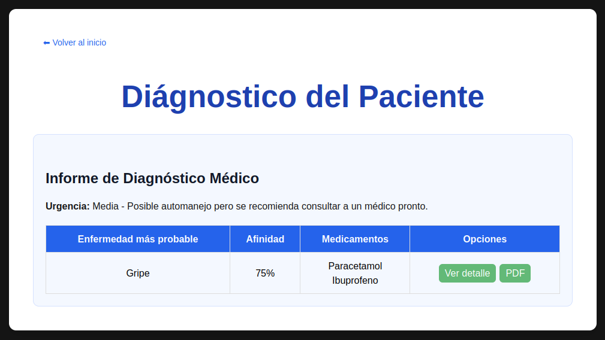

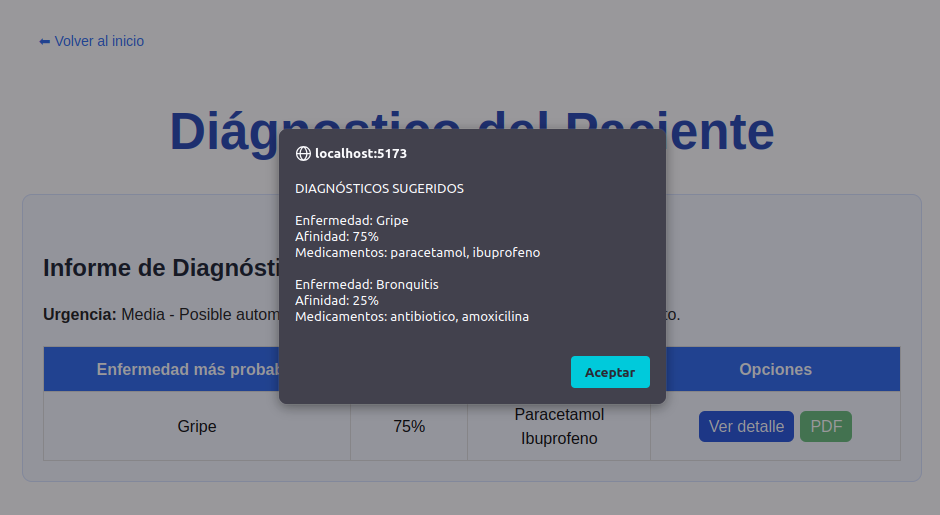

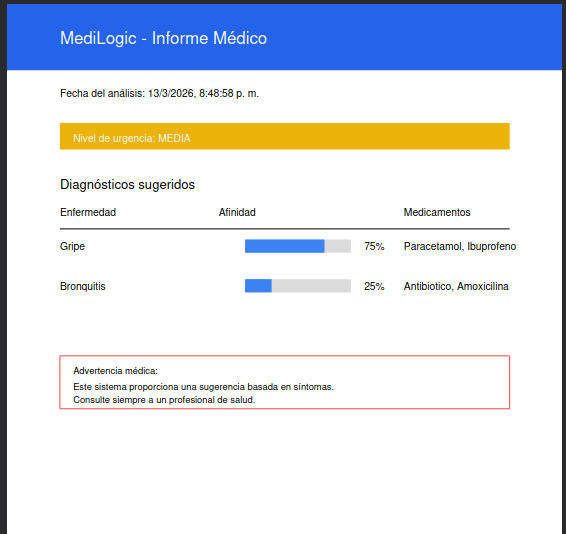

***
### Dashboard Administrador 
***
Este módulo permite al administrador los siguientes modulos:

- Enfermedades
- Administrar medicamentos
- Gestionar archivos

#### Enfermedades

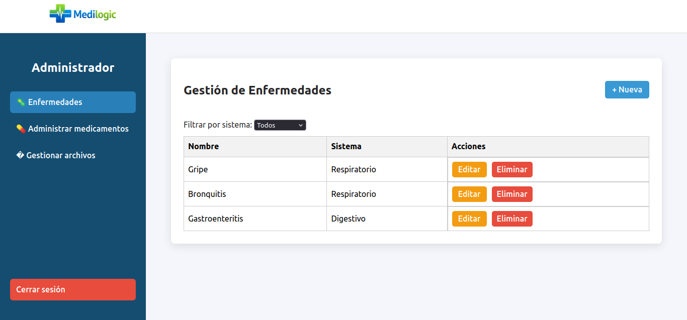

Desde esta sección, el administrador puede:
- Crear nuevas enfermedades y asociarlas a síntomas, medicamentos y sistemas del cuerpo. Si en caso no existe algun sintoma, medicamento o sistema, el administrador puede crearlos.

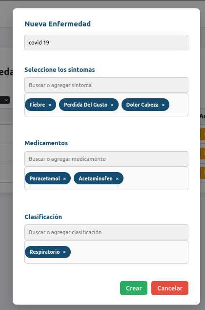

- Editar enfermedades existentes para actualizar síntomas o tratamientos.

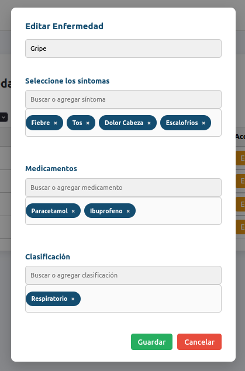

- Eliminar enfermedades que ya no sean relevantes.

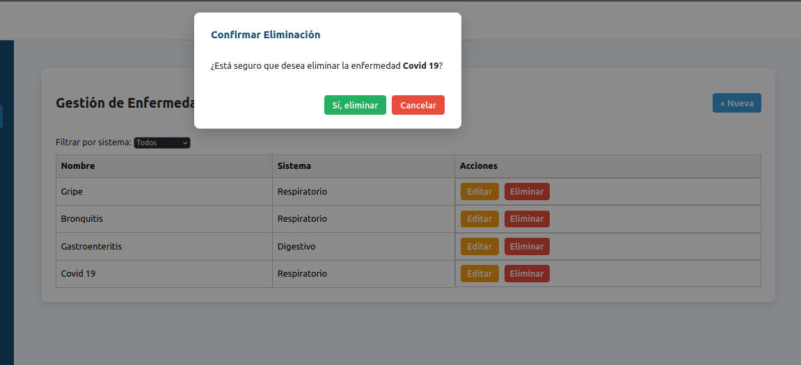

- Consultar rápidamente la lista completa de enfermedades y sus detalles.
    - Filtro enfermedades por el tipo de sistema

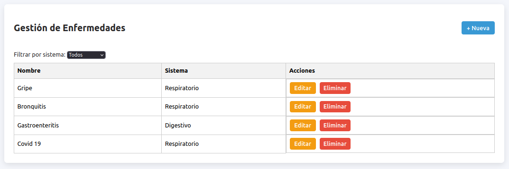

#### Administrar medicamentos

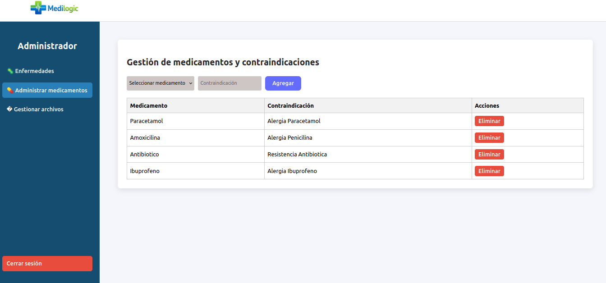

Desde esta sección, el administrador puede:
- Gestionar contraindicaciones para pacientes con alergias o condiciones médicas específicas.

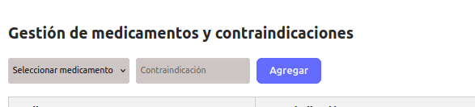

- Eliminar medicamentos obsoletos o peligrosos del sistema.

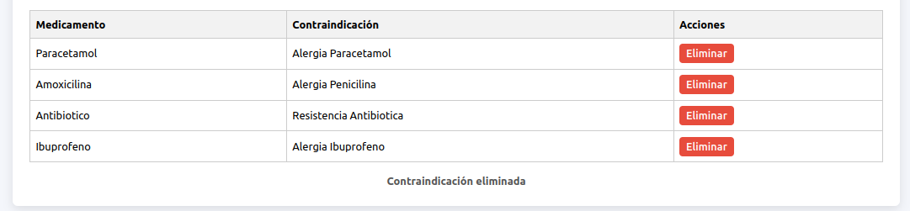

#### Gestionar archivos

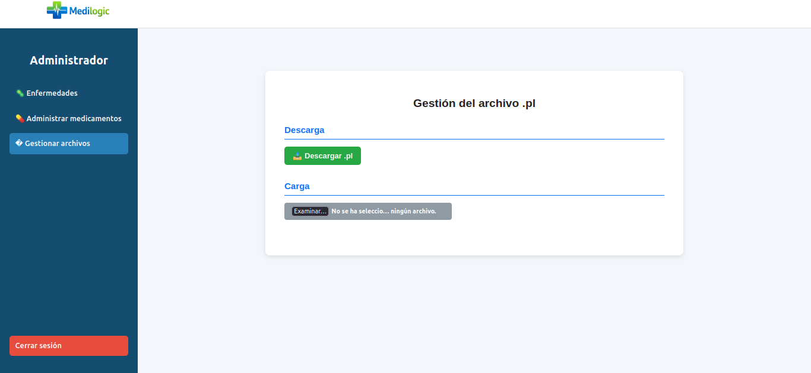

Desde esta sección, el administrador puede:
- Subir archivos de base de conocimiento (medilogic.pl) para actualizar la lógica de diagnóstico.

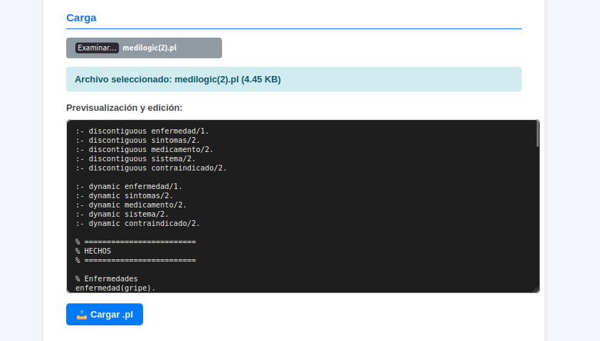

- Descargar archivos de reporte o base de conocimiento para respaldo o análisis.

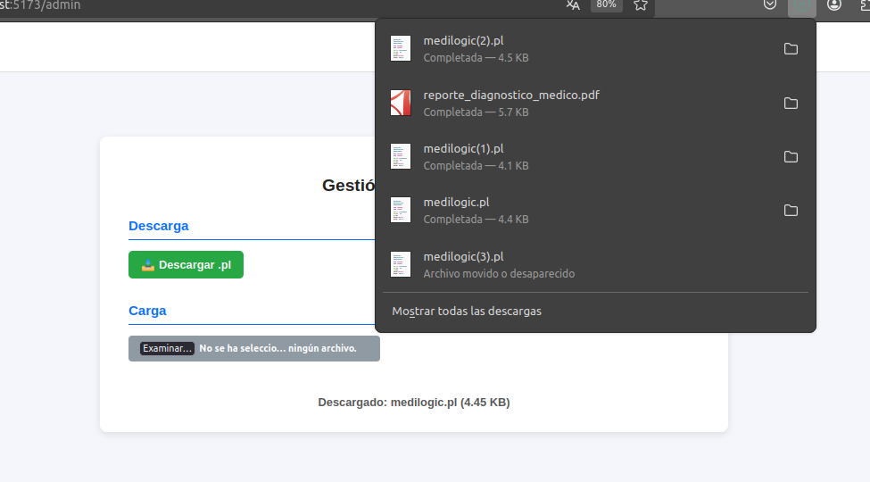

[REGRESAR](../README.md)